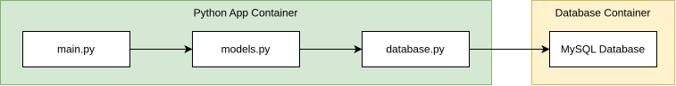

# cicd-containerized-mysql-app
A technical demonstration of a containerised Python user-management microservice with automated PyTest suites, MySQL persistence, and a Jenkins CI/CD pipeline.

(Currently a work-in-progress)

### System Diagram
Basic system diagram:
